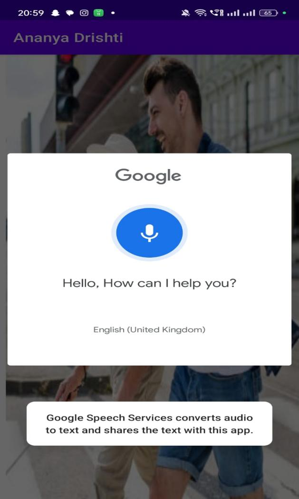
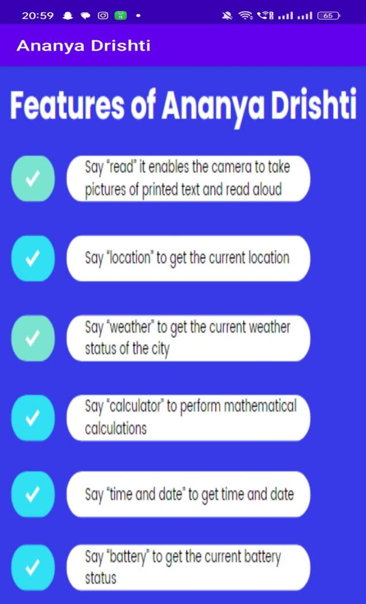

# Ananya-Drishti_MobileApp

## Understanding the Needs:
The increasing number of visually impaired individuals presents significant hurdles in daily tasks, particularly reading printed and digital text. To address this, we developed the Ananya Drishti Android app using OCR (Optical Character Recognition) technology. This app converts text from sources like newspapers, signboards, and digital screens into audio format, providing essential accessibility for visually impaired users.

## Goals and Objectives:
Our project aims to make a meaningful impact by creating a user-friendly mobile application in Kotlin for Android:

- **Voice Options:** Users can select preferred voice settings (speed, pitch, volume) for text-to-speech output.
  
- **OCR Reader:** Instantly converts captured text from a camera into speech using OCR technology.
  
- **Built-in Calculator:** Includes essential arithmetic operations for added convenience.
  
- **Real-time Weather Updates:** Integrates with a weather API to provide current conditions, forecasts, and alerts.
  
- **Location Services:** Utilizes GPS for location-based services and navigation assistance.
  
- **Battery and Time Monitoring:** Displays device battery status, remaining percentage, estimated depletion time, and offers customizable time/date formats.
  
- **App Management:** Ensures user security with a dedicated exit button that prompts confirmation before closing the application.

## Technical Insights:
- **Front End:** Developed using XML.
- **Programming Language:** Kotlin.
- **IDE:** Android Studio.

## Screenshots:

    
    

## Future Impact:
This project is not just about technology; it's about making a positive impact on people's lives. We extend a heartfelt thank you to our dedicated team for their hard work and to everyone who supported us on this journey!

## Contributors

Each member of our team brought unique skills, knowledge, and enthusiasm to the table, contributing to the project's development in diverse ways.
Here are our group members:

1. [Mangesh Pangam](https://github.com/Mangesh2704)

2. [Rakshita Sarap](https://github.com/RakshitaSarap)

3. [Saish Rane](https://github.com/saishrane-11)
